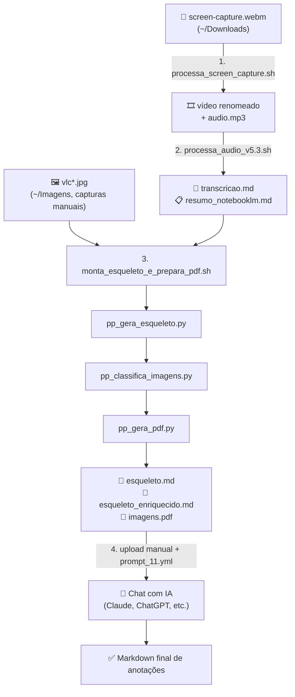

# 🎓 Pipeline de Produção de Material Didático a partir de Screen Capture

Automação ponta a ponta que transforma a gravação bruta de uma aula (vídeo `.webm` + capturas de tela) em um **documento Markdown de anotações**, pronto para uso no Obsidian, com cada imagem da aula seguida do seu comentário didático correspondente — gerado com apoio de IA (Gemini, com fallback para Whisper local).

Este repositório documenta e disponibiliza os scripts de cada etapa do fluxo, na ordem exata de execução.

---

## 🎯 Objetivo final

A partir de:
- um vídeo de captura de tela de uma aula (`screen-capture.webm`);
- capturas de tela feitas durante a aula (`vlc*.jpg`);

gerar um **único arquivo Markdown final**, contendo:
- todas as imagens da aula, em ordem cronológica;
- logo após cada imagem, uma explicação didática do seu conteúdo (incluindo transcrição de código, quando aplicável);
- estrutura pronta para import direto no Obsidian, sem edição manual posterior.

---

## 🗺️ Visão geral do fluxo



---

## 📁 Estrutura de pastas do repositório

```
aula-pipeline-toolkit/
├── README.md
├── LICENSE
├── .gitignore
│
├── config/
│   └── processa_screen_capture.cfg   # modelo do arquivo de config (trilha/módulo/curso)
│
├── scripts/
│   ├── 01-captura_video/
│   │   └── processa_screen_capture.sh
│   │
│   ├── 02-transcricao_audio/
│   │   └── processa_audio_v5.3.sh
│   │
│   └── 03-montagem_material/
│       ├── monta_esqueleto_e_prepara_pdf.sh
│       ├── pp_gera_esqueleto.py
│       ├── pp_classifica_imagens.py
│       └── pp_gera_pdf.py
│
├── prompts/
│   └── prompt_11.yml         # snippet Espanso com o prompt para a etapa final (IA de chat)
```

> 💡 `config/processa_screen_capture.cfg.example` deve ser versionado como **exemplo** (com valores fictícios). O `.cfg` real, com seus dados de trilha/módulo/curso, deve ficar fora do controle de versão (adicione ao `.gitignore`).

---

## ⚙️ Pré-requisitos

| Ferramenta | Uso |
|---|---|
| `ffmpeg` | reparo de container de vídeo e extração de áudio |
| `jq` | parsing de JSON nas chamadas de API |
| `curl` | upload de áudio e chamadas à API Gemini |
| Chave de API Gemini (`GEMINI_API_KEY`) em `~/bin/.env` | transcrição e resumo via IA |
| `whisper` (OpenAI) instalado localmente | fallback caso todos os modelos Gemini falhem |
| Python 3 + `pytesseract`, `Pillow` (`PIL`) | classificação de imagens (OCR) e geração do PDF |
| `tesseract-ocr` instalado no sistema | motor de OCR usado pelo `pytesseract` |
| Fonte `DejaVuSans.ttf` (opcional) | legendas no PDF gerado |

Os três scripts Python (`pp_gera_esqueleto.py`, `pp_classifica_imagens.py`, `pp_gera_pdf.py`) precisam estar no `PATH` (por exemplo, em `~/bin`, com permissão de execução) para serem chamados diretamente pelo `monta_esqueleto_e_prepara_pdf.sh`.

---

## 🚀 Sequência de execução

### Etapa 1 — Captura e preparo do vídeo/áudio
**Script:** `scripts/01_captura_video/processa_screen_capture.sh`

Executado na pasta onde vive o `processa_screen_capture.cfg` (não incluso no repo — veja `config/processa_screen_capture.cfg.example`).

O que faz:
1. Limpa arquivos residuais de execuções anteriores (`vlcsnap-*.jpg`, `debug_*`, `esqueleto*.md`, `imagens.pdf`, `transcricao.md`, `resumo_notebooklm.md`).
2. Repara os timestamps do `~/Downloads/screen-capture.webm` via `ffmpeg -fflags +genpts`.
3. Lê `nome_da_trilha`, `modulo` e `curso` do arquivo `.cfg` local.
4. Descobre o próximo índice de vídeo disponível (`video_01`, `video_02`, ...) para não sobrescrever aulas anteriores.
5. Renomeia o vídeo para o padrão `TRILHA-modulo.X-curso.Y-video_NN.webm` na pasta atual.
6. Extrai o áudio para `~/Downloads/audio.mp3` via `ffmpeg` (libmp3lame).

```bash
cd /caminho/da/pasta/com/o/cfg
./processa_screen_capture.sh
```

**Pré-condição:** o vídeo precisa estar em `~/Downloads/screen-capture.webm` e o `.cfg` precisa estar na pasta de execução.

---

### Etapa 2 — Transcrição e resumo do áudio
**Script:** `scripts/02_transcricao_audio/processa_audio_v5.3.sh`

O que faz:
1. Valida a existência do `.env` (com `GEMINI_API_KEY`), do `audio.mp3` e da dependência `jq`.
2. Faz upload do `audio.mp3` para a API de arquivos do Gemini (upload resumable).
3. Aguarda o processamento (`state == ACTIVE`) do arquivo no lado do Google.
4. Tenta gerar a **transcrição com timestamps** (a cada ~30s), testando uma lista de modelos em ordem de prioridade (`gemini-3-flash-preview` → `gemini-2.5-flash` → `gemini-2.0-flash` → `gemini-2.0-flash-lite`), com retry automático em erros 429.
5. Se todos os modelos falharem, cai para transcrição local via **Whisper** (`--model small --language Portuguese`).
6. Caso a transcrição via API tenha funcionado, gera também um **resumo estilo NotebookLM** com o mesmo mecanismo de fallback entre modelos.
7. Salva `~/Downloads/transcricao.md` e `~/Downloads/resumo_notebooklm.md`.

```bash
./processa_audio_v5.3.sh          # modo silencioso
./processa_audio_v5.3.sh -v       # modo verbose
```

> ⚠️ Se cair no fallback do Whisper, o resumo NotebookLM **não é gerado** (a lógica do script pula essa etapa nesse caso).

---

### Etapa 3 — Montagem do esqueleto, classificação de imagens e geração do PDF
**Script:** `scripts/03_montagem_material/monta_esqueleto_e_prepara_pdf.sh`

Orquestra, em sequência, os 3 scripts Python abaixo. Deve ser executado **depois** de capturar manualmente as telas da aula (via VLC, no formato `vlcsnap-HHhMMmSSsXXX.jpg`) em `~/Imagens`.

1. **Copia** todos os `.jpg` de `~/Imagens` para a pasta atual.
2. Executa `pp_gera_esqueleto.py`
3. Executa `pp_classifica_imagens.py`
4. Executa `pp_gera_pdf.py`
5. Duplica `esqueleto_enriquecido.md` como `esqueleto_enriquecido.txt` (facilita upload em interfaces que não aceitam `.md`).

```bash
cd /pasta/de/trabalho/da/aula
./monta_esqueleto_e_prepara_pdf.sh
```

#### 3.1 `pp_gera_esqueleto.py`
- Varre `~/Imagens` em busca de arquivos `vlc*.jpg` cujo nome contenha timestamp no padrão `HHhMMmSSs mmm` (formato de captura do VLC).
- Ordena as imagens cronologicamente pelo timestamp extraído do nome do arquivo.
- Lê `~/Downloads/transcricao.md`.
- Gera `~/Downloads/esqueleto.md`: um bloco `` por imagem (caminho fixo `000-Midia_e_Anexos/<arquivo>`), seguido de um comentário HTML com instruções para a IA (o que fazer com aquela imagem), e ao final anexa a transcrição completa da aula como apêndice, delimitada por marcadores `<!-- INÍCIO/FIM DA TRANSCRIÇÃO -->`.

#### 3.2 `pp_classifica_imagens.py`
- Lê `~/Downloads/esqueleto.md`.
- Para cada bloco de imagem, roda **OCR** (`pytesseract`) sobre o arquivo correspondente.
- Aplica heurísticas simples (regex) para classificar o conteúdo como **código** (detectando padrões como `def`, `class`, `import`, `echo`, `git`, símbolos de sintaxe) ou **slide conceitual**, e tenta inferir a linguagem (`python`, `bash`, `javascript`).
- Insere comentários HTML de metadado (`<!-- TIPO_DE_IMAGEM -->`, `<!-- POSSIVEL_LINGUAGEM -->`, `<!-- CONFIANCA -->`) logo após cada bloco de imagem.
- Gera `~/Downloads/esqueleto_enriquecido.md`.

#### 3.3 `pp_gera_pdf.py`
- Lê `~/Downloads/esqueleto_enriquecido.md` e extrai, via regex, os nomes de arquivo de todas as imagens referenciadas.
- Abre cada imagem em `~/Imagens`, grava o nome do arquivo como legenda sobre a própria imagem.
- Compila todas as imagens, em ordem, em um único PDF: `~/Downloads/imagens.pdf`.

> 📌 O PDF existe para dar à IA de chat (etapa 4) uma **fonte visual confiável e sequencial** das imagens, já que nem toda interface de chat processa bem múltiplos anexos de imagem soltos.

---

### Etapa 4 — Geração das anotações finais via IA de chat
**Prompt:** `prompts/prompt_11.yml`

Passos manuais:
1. Fazer upload, na interface de chat de sua preferência, dos dois artefatos gerados:
   - `~/Downloads/imagens.pdf` (fonte visual, uma imagem por página, em ordem cronológica);
   - `~/Downloads/esqueleto_enriquecido.md` (documento-base com estrutura, nomes de arquivo e metadados de classificação).
2. Disparar o snippet `:p11` (gerenciado via [Espanso](https://espanso.org/)), que expande para o prompt completo definido em `prompt_11.yml`.

O prompt instrui a IA a:
- tratar o Markdown como um **contrato estrutural imutável** (não reordenar, renomear ou remover blocos de imagem);
- sempre apresentar **a imagem antes** do texto explicativo correspondente;
- restringir cada explicação **exclusivamente** ao conteúdo da imagem imediatamente anterior (proibido antecipar conteúdo de imagens seguintes);
- transcrever fielmente blocos de código, com a linguagem correta, quando a imagem contiver código;
- não mencionar a existência de uma "transcrição" no resultado final (a transcrição é apenas contexto interno, não deve aparecer redigida na saída);
- declarar explicitamente quando não for possível associar uma imagem ao conteúdo com segurança.

O resultado é um único arquivo Markdown, pronto para uso direto no Obsidian.

---

## 🧵 Resumo passo a passo (checklist rápido)

1. [ ] Gravar a aula → `~/Downloads/screen-capture.webm`
2. [ ] Capturar telas relevantes durante a aula com o VLC → `~/Imagens/vlcsnap-*.jpg`
3. [ ] `./processa_screen_capture.sh` (na pasta do `.cfg`)
4. [ ] `./processa_audio_v5.3.sh`
5. [ ] `./monta_esqueleto_e_prepara_pdf.sh`
6. [ ] Upload de `imagens.pdf` + `esqueleto_enriquecido.md` no chat de IA
7. [ ] Disparar `:p11` e revisar o Markdown final
8. [ ] Salvar o resultado nas anotações do curso 🎉

## Exemplo de pipeline

### Preparo do vídeo, exportação do áudio, geração da transcrição e do resumo:

Executar na pasta do arquivo `processa_screen_capture.cfg`(normalmente `000-Midia_e_Anexos`).

```bash
processa_screen_capture.sh; processa_audio_v5.3.sh
```

#### Saída:

```bash
━━━━━━━━━━━━━━━━━━━━━━━━━━━━━━━━━━━━━━━━━━━━━━━━━━━━━━━━━━━━
🎬  Iniciando o Processamento da Aula
━━━━━━━━━━━━━━━━━━━━━━━━━━━━━━━━━━━━━━━━━━━━━━━━━━━━━━━━━━━━
🔍 [1/6] Verificando se o vídeo está em Downloads...
    ✅ Vídeo localizado!
🛠️  [2/6] Corrigindo timestamps do vídeo (ffmpeg)...
[opus @ 0x5c98b33f51c0] Error parsing Opus packet header.
    ✅ Vídeo estabilizado e movido para a pasta de trabalho.
📋 [3/6] Lendo arquivo de configuração...
    ✅ Configurações carregadas: bootcamp_ntt_data_java_spring_ai
🔢 [4/6] Calculando o próximo número da sequência...
    ✅ O próximo arquivo será o de número: 05
🏷️  [5/6] Aplicando nome oficial ao arquivo...
    ✅ Pronto: bootcamp_ntt_data_java_spring_ai-modulo.03-curso.03-video_05.webm
🎵 [6/6] Extraindo áudio para revisão...
[opus @ 0x62310733d800] Error parsing Opus packet header.
    ✅ Áudio salvo em: ~/Downloads/audio.mp3
━━━━━━━━━━━━━━━━━━━━━━━━━━━━━━━━━━━━━━━━━━━━━━━━━━━━━━━━━━━━
✨  Terminado!
━━━━━━━━━━━━━━━━━━━━━━━━━━━━━━━━━━━━━━━━━━━━━━━━━━━━━━━━━━━━
🔍 Validando arquivos...
----------------------------------------------------------
🤖 Modelos disponíveis (em ordem de prioridade):
   1. gemini-3-flash-preview
   2. gemini-2.5-flash
   3. gemini-2.0-flash
   4. gemini-2.0-flash-lite
   5. Whisper (fallback final)
📝 VERSÃO 5.2.1 - Temporizador Ativo
🚀 Processando: audio.mp3
----------------------------------------------------------
📤 Preparando upload para o Google Cloud...
📤 Enviando bytes do arquivo...
✅ Upload concluído: files/0ggm3idxs2ml
⏳ Google processando o áudio
✅ Áudio pronto para processamento!
🎯 [1/2] Gerando transcrição formatada com timestamps...
🔄 Tentando com modelo: gemini-3-flash-preview
🔄 Tentando com modelo: gemini-2.5-flash
   ✅ Sucesso com gemini-2.5-flash!
✅ Transcrição salva!
📚 [2/2] Gerando resumo NotebookLM...
🔄 Tentando com modelo: gemini-3-flash-preview
🔄 Tentando com modelo: gemini-2.5-flash
🔄 Tentando com modelo: gemini-2.0-flash
🔄 Tentando com modelo: gemini-2.0-flash-lite
✅ Resumo salvo!
==========================================================
✨ CONCLUÍDO EM 2m 59s
==========================================================
```

### 2) Montagem do esqueleto, classificação de imagens e geração do PDF:

Executar na sequência (na mesma pasta).

```java
monta_esqueleto_e_prepara_pdf.sh
```

#### Saída:

```bash
━━━━━━━━━━━━━━━━━━━━━━━━━━━━━━━━━━━━━━━━━━━━━━━━━━━━━━━━━━━━
📸  Iniciando Fluxo de Documentação de Aula
━━━━━━━━━━━━━━━━━━━━━━━━━━━━━━━━━━━━━━━━━━━━━━━━━━━━━━━━━━━━
📂 [1/4] Coletando imagens JPG de ~/Imagens...
    ✅ Imagens copiadas para a pasta atual.
🏗️  [2/4] Executando: pp_gera_esqueleto.py...
Esqueleto Markdown gerado com sucesso: /home/arthur/Downloads/esqueleto.md
    ✅ Estrutura criada com sucesso.
🏷️  [3/4] Executando: pp_classifica_imagens.py...
esqueleto_enriquecido.md gerado com sucesso em /home/arthur/Downloads/esqueleto_enriquecido.md
    ✅ Imagens classificadas.
📄 [4/4] Executando: pp_gera_pdf.py...
PDF gerado com sucesso: /home/arthur/Downloads/imagens.pdf
    ✅ PDF gerado com sucesso!
━━━━━━━━━━━━━━━━━━━━━━━━━━━━━━━━━━━━━━━━━━━━━━━━━━━━━━━━━━━━
✨  Fluxo finalizado com sucesso!  🚀
━━━━━━━━━━━━━━━━━━━━━━━━━━━━━━━━━━━━━━━━━━━━━━━━━━━━━━━━━━━━
```

### 3) Upload dos arquivos `imagens.pdf` e `esqueleto_enriquecido.md` e execução do `prompt_11`

<p align="center">
  
</p>

## Resultado final

### Exemplo de arquivo gerado: 

- [aula-maven-lombok-mapstruct.md](resultado/aula-maven-lombok-mapstruct.md)

Trecho:

<p align="center">
  
</p>

📌 Limpeza pós-processamento: O arquivo Markdown gerado pela IA pode conter comentários em HTML e a transcrição bruta como apêndice. Para obter um documento final "limpo" (contendo apenas as referências às imagens e o conteúdo didático), utilize o prompt contido em prompts/prompt_repita.yml (snippet :rep no Espanso). Este prompt remove metadados, comentários técnicos e a transcrição, deixando o arquivo pronto para consumo final.

### Exemplo de saída: Material de estudo estruturado

A captura abaixo (apenas um trecho) demonstra o resultado final após a execução do pipeline e aplicação do prompt de limpeza (prompt_repita.yml). Note a organização sequencial, onde a captura de tela é sucedida pela explicação didática e pelo bloco de código, mantendo a estrutura ideal para consulta rápida e produtiva.

<p align="center">
  
</p>

---

## 🛠️ Possíveis melhorias futuras
- Empacotar as etapas 1–3 em um único script "mestre" com tratamento de erro entre etapas.
- Adicionar testes automatizados para as heurísticas de classificação de imagem (`pp_classifica_imagens.py`).
- Permitir configurar o modelo de IA e o idioma via variáveis de ambiente em vez de edição direta do script.
- Automatizar a etapa 4 via API (hoje é manual, feita em interface de chat).

---

## 📄 Licença

Este projeto está licenciado sob a [MIT LICENSE](LICENSE).

---

## ✍️ Autor

**Arthur Haerdy Jr** 
<br>LinkedIn / [arthur-haerdy-jr](https://www.linkedin.com/in/arthur-haerdy-jr/)